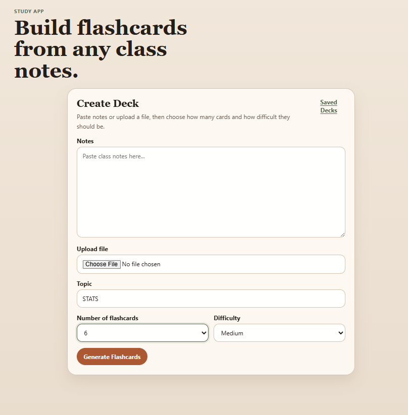
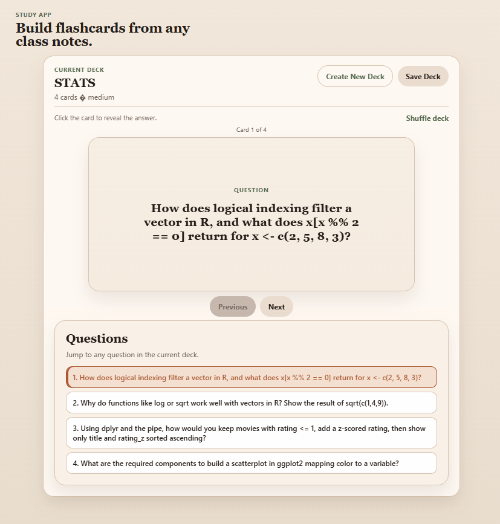
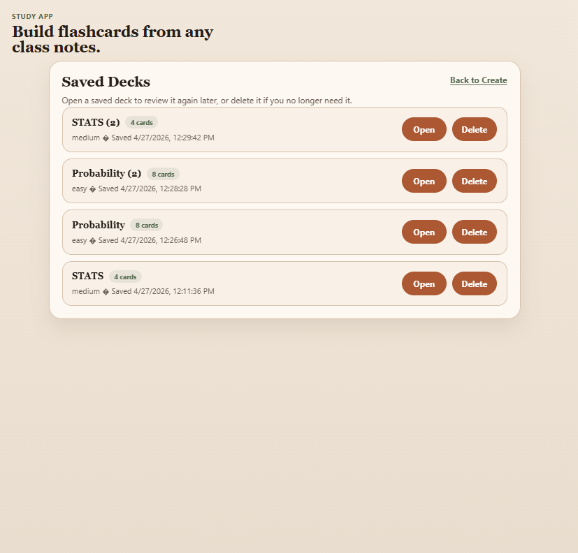

# Flashcards Generator

An AI-powered study app that lets you paste or upload notes, add a topic, and generate flashcards for review.

## Live App
[Open the app](https://flashcards-generator-g358.onrender.com/)

## Screenshots

### Create Deck


### Review Mode


### Saved Decks


## Features

- Paste notes directly into the app
- Upload `.txt`, `.md`, `.csv`, or `.docx` notes
- Generate flashcards with AI
- Review one flashcard at a time
- Shuffle the current deck
- Save decks locally in the browser
- Reopen or delete saved decks later


## Tech Stack

- HTML
- CSS
- JavaScript
- Node.js
- Express
- OpenAI API
  
## Setup

1. Install dependencies:

    ```bash
   npm install

2. Create a `.env` and add your OpenAI API key

3. Start the app:

   ```bash
   npm start
   ```

4. Open `http://localhost:3000`

## Notes

- Keep your API key in the server `.env` file, not in browser JavaScript.
- `.docx` files are parsed on the server before flashcard generation.
